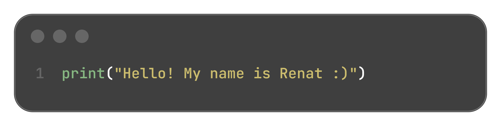

  

---

## 💡 About Me

🎓 Студент 4 курса Санкт-Петербургского Политихнического университета Петра Великого

🧠 Backend-developer на Python с актуальным стеком

🤖 Разрабатываю Web-приложения, Telegram-ботов и Mini Apps  

🐧 Работал с низким уровнем на C/C++, Assembler и даже собирал ячейку памяти на логических элементах - упреки "системной" элиты не воспринимаю xD     

⚙️ Люблю чистый код без костылей и продуманную архитектуру

❤️ Несу добро людям через призму IT

---

## 🧰 My Stack

  
  
  
  
  
  
  
  
  
  

---

## 🚀 My Projects

### 🔹 [Telegram-бот с учебным расписанием ИСПО](https://github.com/Pitonslaver228/students-schedule-bot)
> Telegram-бот с учебным расписанием для студентов ИСПО СПбПУ им. Петра Великого.  
> **Технологии:** Python, aiogram, aiosqlite, asyncio.

---

### 🔹 [Telegram-бот Анонимный чат](https://github.com/Pitonslaver228/anonymous-chat-bot)
> Telegram-бот, соединяющий случайных пользователей для общения.  
> **Технологии:** Python, aiogram, aiosqlite, asyncio.

---

### 🔹 [Telegram-бот для поиска арбитражных связок](https://github.com/Pitonslaver228/crypto-arbitrage-bot)
> Автоматический поиск и анализ цен на криптовалютных биржах, вычисление арбитражных возможностей, работа с API.  
> **Технологии:** Python, aiogram, asyncio, REST API.

---

## 📊 GitHub Metrics

  

## 🐍 Contributions

  

---

## 📫 Contacts

📧 [Email: gaibatovrenat@yandex.ru](mailto:gaibatovrenat@yandex.ru)  

